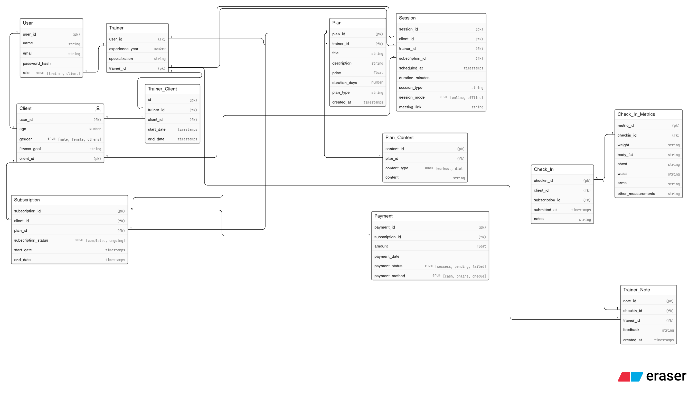

# dbms-system-design
Cohort Webdev Project

## Database Schema

### Overview
The Fitness Coaching Platform uses a comprehensive relational database design to manage users, training sessions, fitness plans, subscriptions, and client progress tracking.

### ER Diagram

### Core Entities

**User** - Base entity for all platform users with role-based distinction:
- Stores user credentials, contact information, and role type (trainer/client)
- Supports password hashing for security

**Trainer** - Specialization of User:
- Tracks professional experience, specialization areas, and years of experience
- Manages trainer-client relationships and training sessions

**Client** - Specialization of User:
- Maintains fitness goals, age, and gender information
- Tracks subscriptions and progress through check-ins

**Plan** - Fitness training programs:
- Defines pricing, duration, and training type
- Links to content modules and trainer assignments

**Session** - Individual training sessions:
- Records scheduled and completed sessions
- Supports both online and offline modes
- Links clients to trainers through subscriptions

**Subscription** - Client enrollment in plans:
- Tracks subscription status (active, completed, paused)
- Manages plan tenure with start and end dates

**Check_In & Check_In_Metrics** - Client progress tracking:
- Records body measurements (weight, body fat, chest, waist, arms, etc.)
- Enables progress monitoring over time

**Payment** - Transaction management:
- Tracks subscription payments with status and method
- Supports multiple payment channels

**Additional Entities** - Supporting features:
- **Plan_Content** - Training materials and resources within plans
- **Trainer_Note** - Trainer feedback and observations on client progress
- **Trainer_Client** - Many-to-many relationship between trainers and clients
