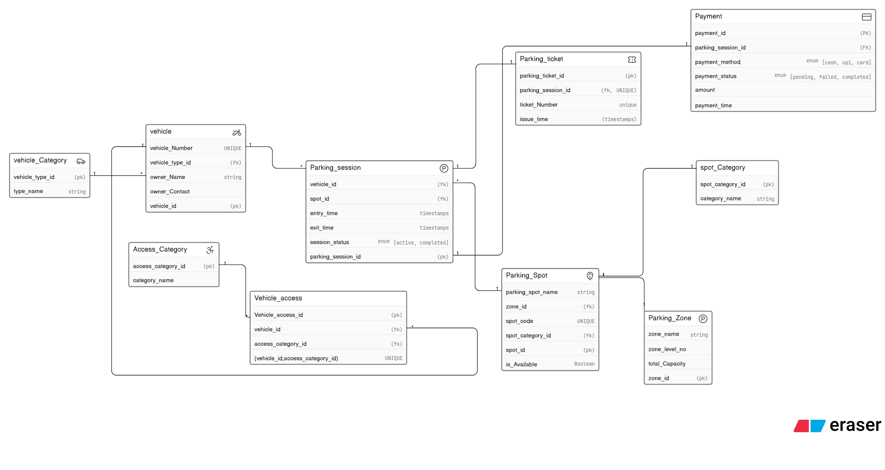

# Vehicle Parking System

This project models the database design for a vehicle parking system.

## ER Diagram

## Main Entities

- `vehicle_category` stores the supported vehicle types.
- `vehicle` stores owner and vehicle details.
- `access_category` and `vehicle_access` define access rules for vehicles.
- `parking_zone` groups parking areas by level and capacity.
- `parking_spot` tracks individual spots and availability.
- `parking_session` records entry and exit times for a parked vehicle.
- `parking_ticket` stores ticket issuance details.
- `payment` stores payment method, status, amount, and time.
